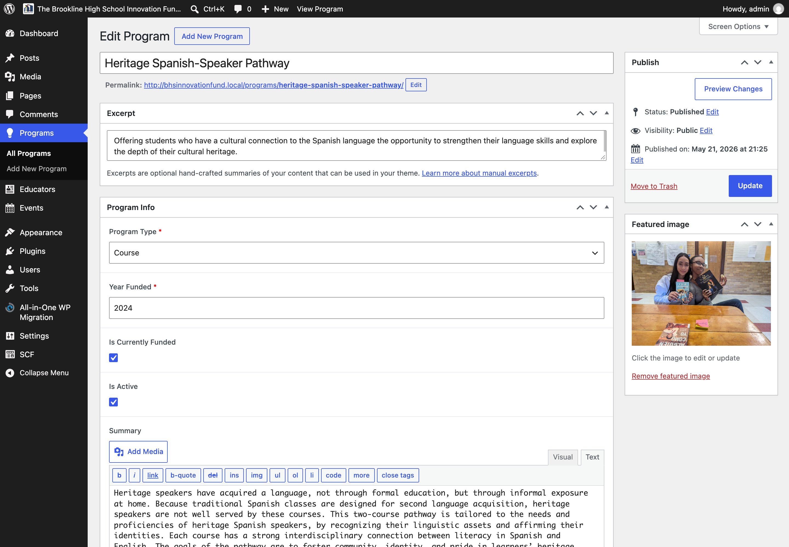
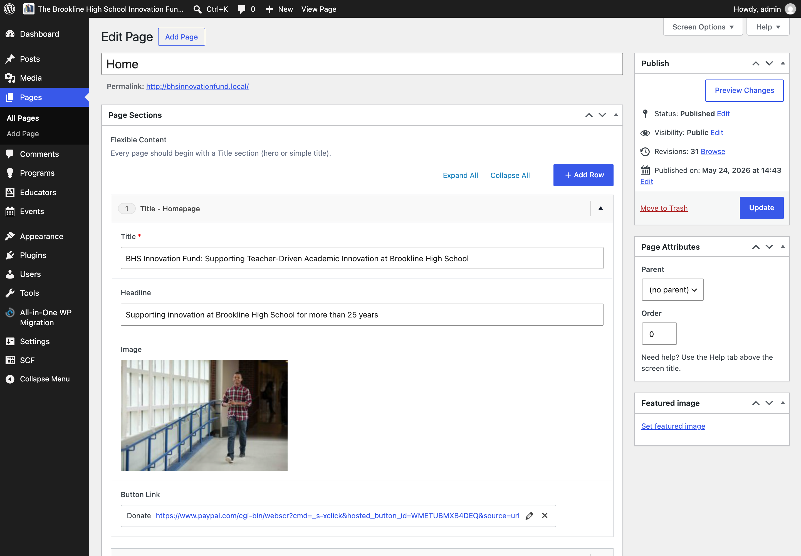
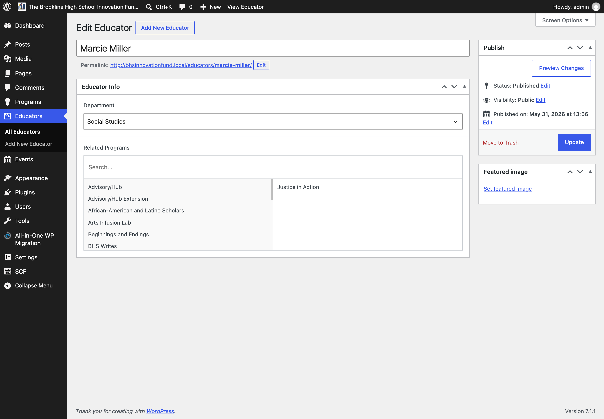

# Brookline High School Innovation Fund

A custom WordPress theme and structured content-management experience for the [Brookline High School Innovation Fund](https://bhsinnovationfund.org/), a nonprofit organization supporting educational innovation in Brookline, Massachusetts.

**Status: Under development**

The public site is live, but the custom theme, content model, and editorial experience are still being developed and refined.

**[Live Demo](https://innovationfund.dreamhosters.com/)**

## Overview

This project involves rebuilding the Innovation Fund's website with a custom WordPress theme and a more structured content-management workflow.

The work is focused not only on the public-facing interface, but also on the underlying content model and WordPress editing experience. The site is intended to be maintained by a staff member, so the content-management system needs to support straightforward updates while reducing opportunities for inconsistent formatting and presentation.

The existing site's implementation presented challenges involving responsive behavior, typography, color and font customization through the WYSIWYG editor, text size, contrast, and heading consistency. The new implementation preserves much of the existing visual direction while introducing more structured content and targeted improvements to accessibility, responsiveness, and consistency.

## Project Goals

- Build a maintainable custom WordPress theme.
- Create a structured content model for programs, educators, events, and news.
- Provide a manageable editorial workflow for the site's staff maintainer.
- Reduce reliance on arbitrary formatting within the WordPress editor.
- Improve responsive behavior and accessibility.
- Establish a local development workflow with version control and automated theme deployment.
- Support relationships between related content, such as programs and educators.

## Content Architecture

The site uses WordPress's content-management capabilities alongside custom post types and structured fields.

The current content model includes:

- **Programs:** Information about programs supported by the Innovation Fund.
- **Educators:** Information about educators associated with programs.
- **Events:** Fundraising, promotional, and other organizational events.
- **News:** Updates and stories managed through WordPress Posts, with structured fields and relationships to relevant programs and events.
- **Page sections:** Structured page content that can be composed from predefined layouts.

Relationships between content types help connect related information without requiring the same content to be repeatedly entered in multiple places.

The content model and editorial experience remain under development as the needs of the organization and its staff maintainer become clearer.

## WordPress Implementation

The site is built using a custom WordPress theme with a structured editing experience.

Key implementation elements include:

- Custom WordPress theme developed with PHP, CSS, Vite, and pnpm.
- Secure Custom Fields (SCF) used to create structured fields and support custom content types.
- Custom post types for content such as Programs and Educators.
- Relationships between related content types.
- Flexible page sections for structured page composition.
- Custom WordPress administration adjustments to support the intended editorial workflow.
- Custom properties and responsive styling for consistent presentation across screen sizes.

The implementation prioritizes a balance between structured content and a manageable editing experience. The goal is to give the site's maintainer useful content controls without requiring them to manually manage presentation details such as arbitrary font sizes, colors, or layout decisions.

## Content Management Interface

The WordPress administration interface is an important part of the project. In addition to building the public-facing site, the project involves designing the editing experience around the needs of the person who will maintain the content.

The following screenshots will document representative parts of the custom WordPress interface.

### Structured content

A representative custom post type editing screen showing structured fields for content such as a Program or Educator.

### Flexible page sections

A page editing screen showing the structured page sections used to compose page content.

### Related content

A representative editing screen showing relationships between related content, such as Programs, Educators, Events, or News.

_Screenshots will be added as the editing interface and content model continue to be refined._

## Frontend and Accessibility

The frontend implementation focuses on maintaining a consistent visual system while improving the site's behavior across screen sizes.

Areas of focus include:

- Responsive layouts and presentation.
- Consistent typography and spacing.
- Semantic content structure and heading hierarchy.
- Color contrast and readable text.
- Reducing reliance on formatting entered manually through the WordPress editor.
- Making content and interactions more accessible and consistent.

The existing visual direction is being preserved in many areas, with smaller design and implementation changes introduced where they improve accessibility, consistency, or usability.

Further accessibility and responsive testing remains part of the ongoing development process.

## Development and Deployment

The theme is developed locally and maintained in GitHub.

The development workflow includes:

- Local WordPress development.
- Git-based version control.
- Vite and pnpm for frontend asset development.
- SCSS/CSS for theme styling.
- GitHub Actions for automated theme build and deployment.

The GitHub Actions workflow automatically:

1. Builds the theme's CSS assets.
2. Copies the resulting theme files to the production server.

This provides an automated deployment process for changes to the theme itself.

### Theme and database deployment

The theme deployment workflow and the WordPress database are managed separately.

The initial production setup was established using **All-in-One WP Migration and Backup**, including migration of the WordPress database to the live site.

Changes to the theme are deployed automatically through GitHub Actions. Changes to WordPress content, custom fields, and other database-managed information are not automatically synchronized through this workflow and may require a separate, more manual process.

This separation allows theme development and deployment to follow a version-controlled workflow while WordPress content remains managed through the CMS.

## Current Status and Future Work

The project is under development. The public-facing site and core content structures are in place, while the theme, editorial experience, and content model continue to be refined.

Potential future work includes:

- Further accessibility and responsive testing.
- Continued refinement of the WordPress editing experience.
- Additional improvements to the content model and relationships.
- Further refinement of the frontend's visual consistency.
- Documentation of the editorial workflow for the staff maintainer.
- Additional testing across browsers, screen sizes, and interaction methods.

## Development Environment

The project uses the following technologies and tools:

- WordPress
- PHP
- Secure Custom Fields (SCF)
- SCSS/CSS
- Vite
- pnpm
- Git and GitHub
- GitHub Actions

## Links

- [Live site](https://innovationfund.dreamhosters.com/)
